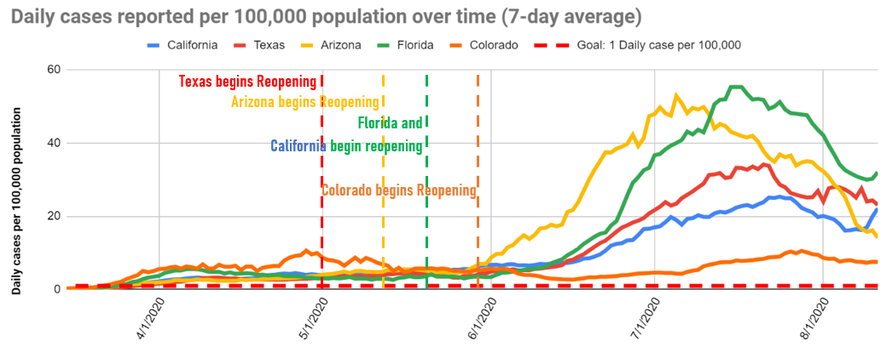
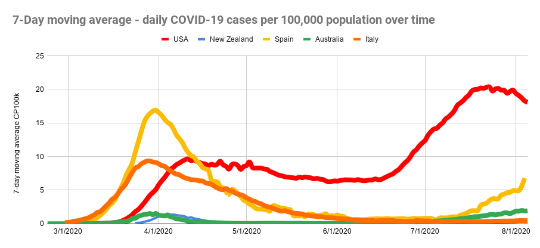
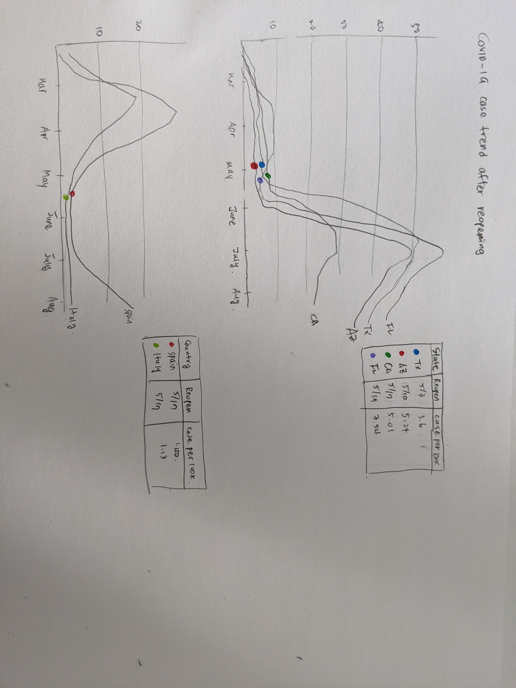

# COVID-19 case trend after reopening

## 1. Find a data visualization
I found these data visualizations in [ConnPIRG](https://connpirg.org/blogs/covid-19/usp/what-went-wrong-first-covid-19-shutdown){:target="_blank" rel="noopener"} which advocates for the public interest. The author is criticizing the US government’s shutdown and reopening policy against COVID-19, by comparing it with different governments. The overall problem of the story is that the visualizations are not compiled together to deliver the author’s message coherently. The visualization itself also contains many glaring problems (The details were covered in the critique assignment). Among many visualizations, I have selected two visualizations below to improve and integrate into one chart. 

The first graph

The second graph

## 2. Wireframe a solution

### (1) The first graph
1) I have marked the reopening dates in different sections not to interfere with the graphs. Also doing so will eliminate the redundancies and overlapping in the text labels.  
2) I have excluded Colorado from the graph because it does not show any impactful trend that is helpful in telling the story.  
3) I have added the case number per 100K at the time of reopening date, as this would be the critical criteria in determining the reopening. According to this article, the public health experts said the cases should be less than 1 per 100K for the safe reopening. The message that the US states did not follow the recommendations had to be clearly delivered. 
4) I have removed the goal (Y=1) from the graph. The graph will be located too low which might be difficult to catch. I can supplement this information using the subtitle.  

### (2) The second graph
1) I will display the second graph side-by-side to the first graph, to compare the policies.  
2) I removed New Zealand and Australia from the graph as they do not show the similar case number as the US. On the other hand, Spain and Italy had similar trends before shutdown but showed significantly different outcomes owing to the reopening policy that started when the case number was down to near 1.  
3) Other arrangements in displaying elements will be similar to the first graph, for consistency.  

## 3. Test the solution

I have shown the visualization to two people. One was the data visualization expert and the other one was a general audience. 

**1. Can you tell me what these visualizations are telling you?**
- These two graphs are comparing different government policies. 
- I see Spain and Italy reopened when the case number was lower. 
- The outbreaks in Florida and Texas were severe.

**2. Is there anything confusing in the graphs?**
- The first graph has too much overlapping between lines. 
- It takes some time to understand the differences between two graphs. 
- It is a bit distracting to have a graph and a separate table. 

**3. Who do you think the intended audience?**
- Government officials or Healthcare professionals

**4. The idea here is that the reopening should start when the case number is lower than 1. Do you grasp the idea from the visualizations? If not, what would you do differently?**
- I can understand that, by only looking at the charts for some time as the information is somewhat dispersed. 
- Yes, the idea here is clear. 

After I have conducted two interviews, I was confident that the usefulness, completeness, truthfulness and engagement of my new visualizations were fine. I might need to work more on improving intuitiveness and perceptibility as the audiences spent some time to catch the idea I was trying to deliver. 

I came up with some solutions to improve intuitiveness and perceptibility. As a first step, separating two graphs into 6 small graphs (4 states and 2 countries) might be helpful (grid of line charts). I will add reopen date and case numbers adjacent to the graph, so that the audiences’ eyes do not travel too much. This will also resolve the problem of overlapping texts and graphs. 

## 4. Build my solution

  <noscript></noscript>
  <object class='tableauViz'  style='display:none;'>
    <param name='host_url' value='https%3A%2F%2Fpublic.tableau.com%2F' /> 
    <param name='embed_code_version' value='3' /> 
    <param name='site_root' value='' />
    <param name='name' value='HW4_16138445473640&#47;Sheet1' />
    <param name='tabs' value='no' />
    <param name='toolbar' value='yes' />
    <param name='static_image' value='https:&#47;&#47;public.tableau.com&#47;static&#47;images&#47;HW&#47;HW4_16138445473640&#47;Sheet1&#47;1.png' /> 
    <param name='animate_transition' value='yes' />
    <param name='display_static_image' value='yes' />
    <param name='display_spinner' value='yes' />
    <param name='display_overlay' value='yes' />
    <param name='display_count' value='yes' />
    <param name='language' value='en' />
  </object>

 
I used Tableau to build a new visualization. Tableau was the most versatile tool to manipulate the data into different durations and dimensions. Because of this feature, it was immensely useful in displaying the data by weekly average. Also the annotation tool was flexible enough to display the texts to wherever the information should be displayed. I selected the line chart as it was the most appropriate method to show time series data. 

I worked to improve my initial wireframing using the ideas gleaned from the user interview and self critique score mentioned above. I also changed the title of the graph so that it will add more context to the visualization  - “What went wrong with the US reopening policy?”. Using the subtitle, I illustrated what would have been the correct approach toward the reopening. I displayed 6 graphs side by side, and clearly marked the reopening date and the case number at that time. Now I see 4 US states had reopened when the case number was much higher than 1 and then there were outbreaks after that. On the other hand, Italy and Spain took different strategies and finally managed to control the case numbers. 

Things I am working to improve:
1) The height of the Y axis could be reduced. 
2) It would be more clear if the line color after the outbreak can be darker or lighter. 
