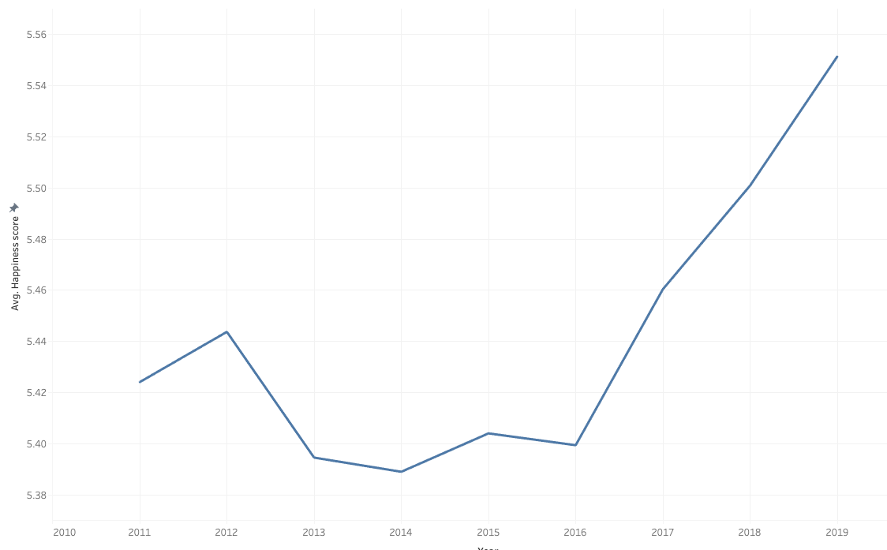
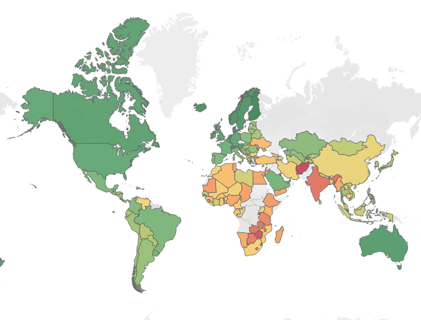
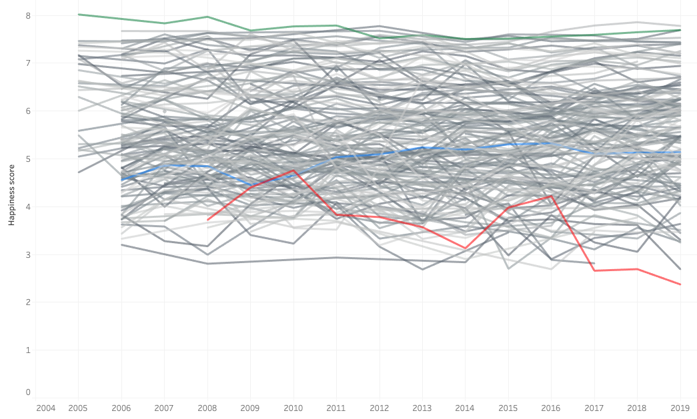
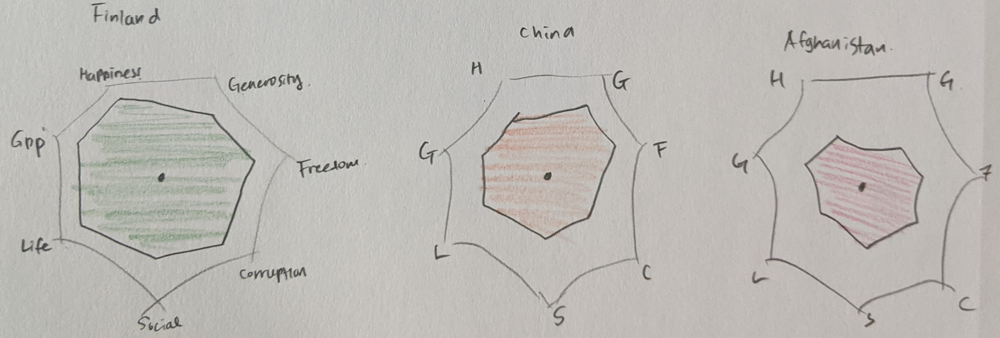
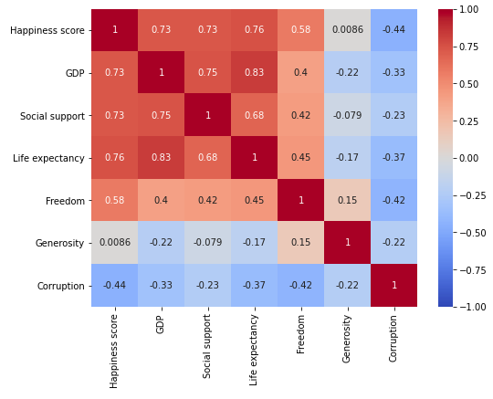
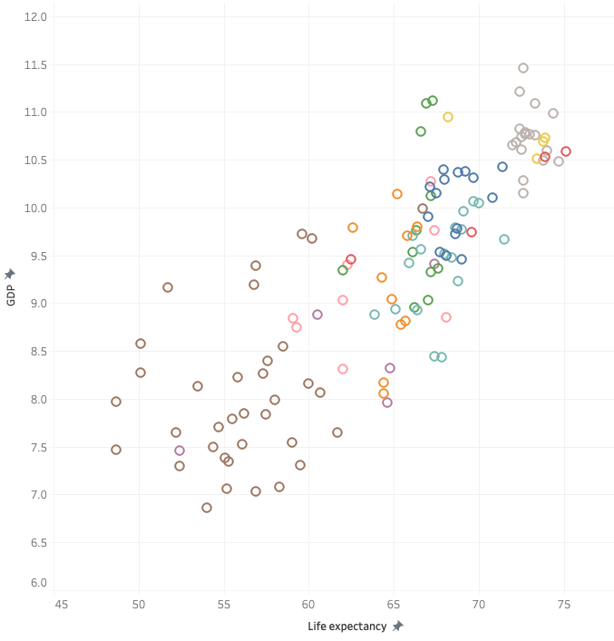
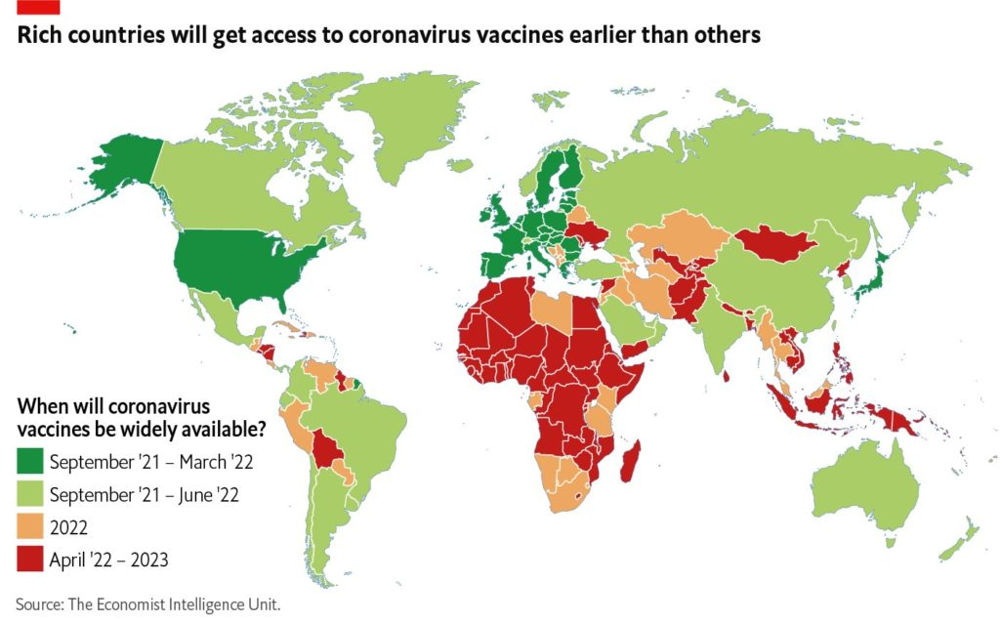
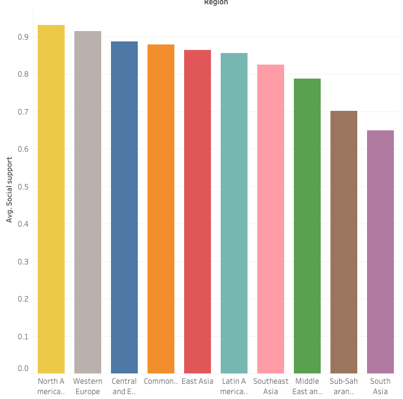

# Part 1: Final project
## An Outine
The World Happiness Report tries to understand how different factors in our lives affect our happiness. I would like to talk about the inequalities of happiness scores throughout the different continents and countries. I will closely look into the relationship between GDP and Life expectancy, which are the most related factors of the happiness score. Finally, in the call-to-action section, I will connect this inequality in happiness to the inequality in the COVID vaccine distribution caused by different buying powers of each country. 

## The data
Before I plotted the outline, I had run some exploratory analysis using Python. From Python, I was able to identify meaningful statistics that I eventually used in my storytelling. 

### 1. Happiness Score

I analyzed the data used in the World Happiness Report (WHR) from 2005 to 2019. The data used in this study is comprehensive as shown in the [file](https://github.com/jessicacha/tswd/blob/main/WHR20data.xls){:target="_blank" rel="noopener"}. In the study, researchers have mainly used the ladder score and six key variables among the entire data in the file. 

1. Ladder score (represented as Happiness score in my story): This score is used to determine the happiness ranking. It is important to note that the happiness ranking is not determined by the combination of six key variables. 

2. Six key variables: GDP per capita (represented as GDP in my story), Social support, healthy life expectancy (Life expectancy), freedom to make life choices (Freedom), Generosity, and freedom from corruption (Corruption). These six variables explain three-quarters of the variation in national annual average ladder scores among countries. 
- **Ladder score**: Ladder score is based on individuals’ own assessments of their lives, raging from 0 to 10, where 10 represents the best possible life.
- **GDP per capita**: GDP divided by the population of a country.
- **Healthy life expectancy**: national average number of “healthy” years a child at birth is estimated to live.
- **Social support**: national average of responses to the question “If you were in trouble, do you have relatives or friends you can count on?” (Yes 1, No 0)
- **Freedom to make life choices**: national average of responses to the question “Are you satisfied or dissatisfied with your freedom to choose what you do with your life?” (Sat 1, Dis 0)
- **Generosity**: the residual of regressing national average of response to the question “Have you donated money to a charity in the past month?” on GDP per capita. (Yes 1, No 0)
- **Corruption**: the average of answers to two questions: “Is corruption widespread throughout the government or not” and “Is corruption widespread within businesses or not?” (Yes 1, No 0)

Source: [Github](https://github.com/jessicacha/tswd/blob/main/WHR20data.xls){:target="_blank" rel="noopener"} 
Original source: [WHR website](https://worldhappiness.report/ed/2020/#read){:target="_blank" rel="noopener"}

### 2. Vaccine availability

1. Vaccine availability map 1: Launch & Scale Speedometer released the timeline of COVID vaccine procurement deals as a tableau visualization. Because I will only use this data as a supplement material in the call-to-action section, I am planning to embed this Tableau visualization in the story and clearly specify the source. 

Source: [Launch & Scale Speedometer](https://launchandscalefaster.org/COVID-19){:target="_blank" rel="noopener"}

2. Vaccine availability map 2: The map released by The Economist depicts the current assumptions for the global rollout of coronavirus vaccines, showing when we expect the shots to be widely available for the general population in each country. 

Source: [The Economics](https://www.eiu.com/n/85-poor-countries-will-not-have-access-to-coronavirus-vaccines/){:target="_blank" rel="noopener"}

## Initial Sketches

### 1. Average world happiness score
If we look at the Average world happiness score, it looks like our lives are getting happier recently. However, would it be true for all countries?
1. Average happiness score line chart from 2010-2019 for all countries: The graph shows the overall world happiness score has been increasing.

2. World heat map: However, it is clear that the happiness score shows inequalities among different countries.

### 2. Gaps between countries
How is the inequality serious and set in our lives? What would be the determinants? 
1. Animated line chart for each country (or continent) (2006-2019): From the chart, we can see that the rankings of countries would not change for 13 years. 

2. Radar chart showing different combinations of factors (Finland, China, Afghanistan): We can see the different combinations of 6 factors for Finland (high rank), China (mid rank) and Afghanistan (low rank). Then, what would be the most important determinants?

### 3. Correlation between factors
1. Correlation heat map: The map shows that GDP, social support and life expectancy have the most strong correlations to the happiness score. Also GDP and life expectancy shows the strong correlation among themselves. 

2. Animated scatter plot between GDP-Life expectancy (2006-2019): The correlation map shows a very strong tendency among different continents. Also this disparity has never been improved throughout the years. 

### 4. Call to action: COVID-19 vaccine inequality
1. News articles: There are many news articles stating the disparity. I can quote some of the key messages in a couple of articles. 
*“More than 85 poor countries will not have widespread access to coronavirus vaccines before 2023”* 
Source: [The Economics](https://www.eiu.com/n/85-poor-countries-will-not-have-access-to-coronavirus-vaccines/){:target="_blank" rel="noopener"}
2. Vaccine availability map: The vaccine inequality heat map from The Economics exactly looks similar to the world happiness score heat map. I will compare them side-by-side, forecasting the decreased life expectancy might drop poor countries’ happiness score even more.

3. Bar graph on social support score: I will wrap up my story by showing disparities in the social support score. Some of Asian countries and African countries cannot expect social support from their community. I would like to urge vaccine companies or the rich governments to be more considerate in distributing and purchasing vaccines. “We need to be their friendly neighbors”.

## Method and Medium

### 1. Storytelling platform
I am going to use Shorthand as my storytelling platform. I might use a not-for-profit template because this is useful in telling a story that is sequential. I will use the first intro part in explaining the happiness score and variants. Then, I can use 3-4 blocks showing different visualizations which will be built upon in sequence. Lastly, I will add some quotes from articles and final visualization in the call to action section. 

### 2. Visualization platform
I will use 3 visualization tools below in different visualizations. As each tool has its own strength, I am going to use the most suitable visualization tool for each graph. Since Tableau and Flourish offers iframe code, I will embed them into the shorthand. The heat map from python will be inserted as an image. 

1. Tableau: Line chart from 2010-2019 for all countries, World heat map, Bar graph on social support score
2. Flourish: Animated line chart for each country (or continent), Radar chart showing different combinations of factors (Finland, China, Afghanistan), Animated scatter plot between GDP-Life expectancy
3. Python: Correlation heat map
