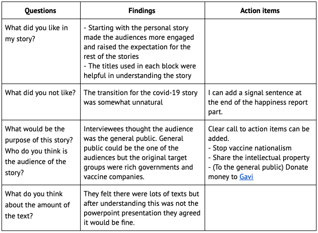
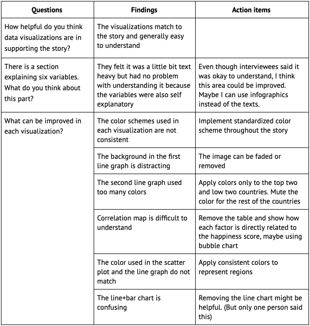

# Part 2: Final project
## Storyboard
Please click [here](https://www.canva.com/design/DAEYHwVcpbc/91l8PpkGGIRxCeqzO9YsVg/view?utm_content=DAEYHwVcpbc&utm_campaign=designshare&utm_medium=link&utm_source=publishsharelink){:target="_blank" rel="noopener"} to see the storyboard. 
## User Research
### 1. Research Protocol
#### 1. Target audience 
- Mainly rich countries’ governments and major vaccine companies
- Also includes general public to bring their attention to the topic

#### 2. Interviewee 
Students in Carnegie Mellon iii program who have different levels of understanding in the data visualization field. (I was not able to reach out to major audiences due to the time limit of this project. I will try to reach out to them before delivering the final presentation.)

#### 3. Background
Exploring the world has always been my passion. In this project, I would like to understand how different factors in our lives affect happiness. I will cover the inequalities of happiness throughout the different continents and countries, then look into the ways to mitigate this issue. 

### 2. Questions, Findings and Action items
#### 1. Story telling
Purpose: 
- To understand how people are engaged in the story
- To spot any glaring issues that need immediate attention

#### 2. Data visualization
Purpose: 
- To understand if the visualizations support the story
- To improve visualizations in more understandable way 

#### 3. Note to self
- Indicate the source / image source clearly in the final project
- Rework on the covid-19 vaccine distribution map
